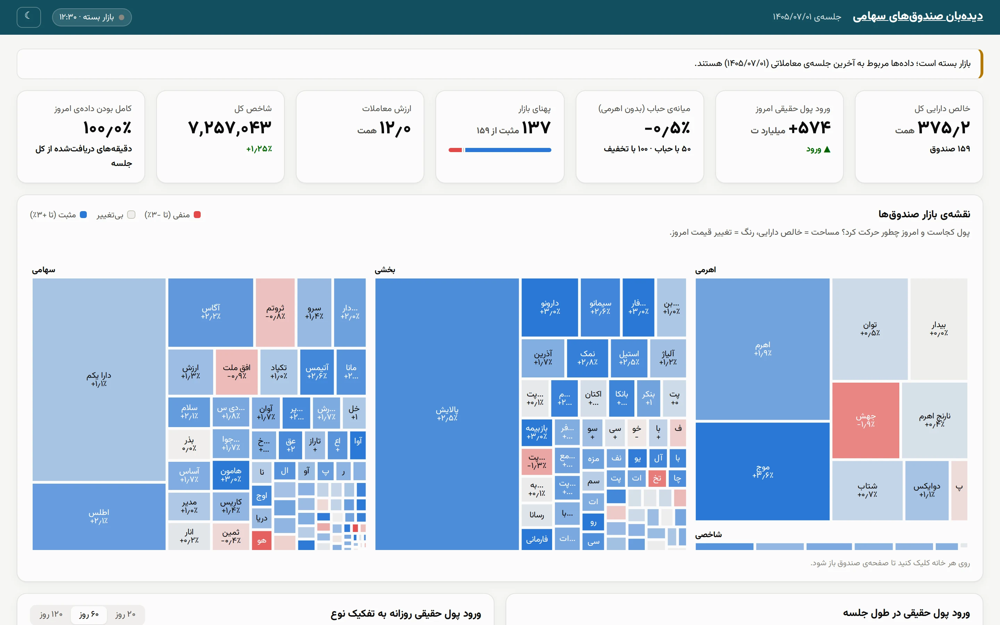

# TSETMCViewer

سرویس دریافت لحظه‌ای، پاک‌سازی، ذخیره‌سازی و تحلیل اطلاعات **صندوق‌های سرمایه‌گذاری قابل معامله سهامی** بورس تهران.

- هر یک دقیقه در ساعات بازار، داده‌ی همه‌ی صندوق‌های سهامی از TSETMC دریافت می‌شود.
- پاسخ خام پیش از هر پردازشی ذخیره می‌شود؛ سپس اعتبارسنجی، پیش‌پردازش و ذخیره در ClickHouse.
- اطلاعات پایه‌ی صندوق‌ها (نوع، تعداد واحد، خالص دارایی) هر روز از اطلاعات نماد در TSETMC تکمیل می‌شود.
- یک پنل وب (React + ECharts) تصویر کلی بازار صندوق‌ها را نشان می‌دهد.

<table>
<tr>
<td width="50%"><br/><sub>نمای کلی: کاشی‌های شاخص و نقشه‌ی بازار، روی داده‌ی واقعی پایان یک جلسه</sub></td>
<td width="50%"><br/><sub>نقشه‌ی بازار: مساحت هر خانه = خالص دارایی، رنگ = تغییر قیمت امروز</sub></td>
</tr>
<tr>
<td width="50%"><br/><sub>نقشه‌ی پول: پول حقیقی دنبال صندوق‌های گران می‌رود یا ارزان</sub></td>
<td width="50%"><br/><sub>مستندات کامل سرویس، داخل همین پنل — بدون سرویس جدا</sub></td>
</tr>
</table>

> **مستندات کامل** همین پنل است: تب «مستندات» (بدون سرویس جدا) همان ۱۲ سند و همه‌ی ADRها را نمایش می‌دهد، با تصویر و نمودار. متن خام همان فایل‌ها در پوشه‌ی [`docs/`](docs/index.md) است؛ برای مرور آن با قالب MkDocs: `make docs-serve`.

## اجرای سریع

```bash
cp .env.example .env
docker compose up -d --build
curl localhost:8000/health
docker compose logs -f collector   # خارج از ساعات بازار: تاریخچه + وضعیت پایانی آخرین جلسه (VPN خاموش)
curl localhost:8000/api/v1/overview
open http://localhost:8080                             # پنل کاربری
docker compose --profile monitoring up -d              # Grafana روی :3000، هشدار به «بله» (اختیاری)
docker compose --profile ha-storage up -d               # دو نسخه‌ی ClickHouse + Keeper (اختیاری، جدا از بالا)
```

| سرویس | نقش |
|---|---|
| `clickhouse` | پایگاه داده‌ی سری زمانی |
| `migrate` | ساخت پایگاه داده و اعمال مایگریشن‌ها (یک بار اجرا و خارج می‌شود) |
| `collector` | حلقه‌ی دریافت دقیقه‌ای در ساعات بازار (با تعطیلات)؛ دو نمونه با یک رهبر |
| `redis` | کش پاسخ‌ها و کانال رویداد «تیک جدید» (اختیاری؛ بدون آن هم کار می‌کند) |
| `api` | FastAPI روی پورت ۸۰۰۰ — مستندات تعاملی در `/docs` |
| `web` | پنل کاربری روی پورت ۸۰۸۰ (nginx: فایل‌های ساخته‌شده‌ی React + پراکسی `/api`)؛ تب «مستندات» همین‌جاست |
| `prometheus` · `alertmanager` · `grafana` · `alert-relay` | پایش و هشدار (profile `monitoring`)؛ [راهنما](docs/11-monitoring.md) |
| `clickhouse-0` · `clickhouse-1` · `clickhouse-keeper` | دو نسخه‌ی `ReplicatedMergeTree` هماهنگ‌شده با Keeper (profile `ha-storage`، اختیاری و کنار `clickhouse` بالا، نه به‌جایش)؛ [ADR 0011](docs/adr/0011-clickhouse-replication.md) |

**نکته‌ی شبکه:** TSETMC معمولاً IP خارج از ایران را مسدود می‌کند. دریافت ایمیج‌ها (Docker Hub) با VPN و اجرای collector بدون VPN — جزئیات در [راهنمای اجرا](docs/08-runbook.md).

## چه چیزی کجاست؟

| سؤال | پاسخ |
|---|---|
| هر نمودار به چه کاری می‌آید؟ | [پنل و نمودارها](docs/06-dashboard.md) |
| حباب، خالص دارایی و ورود پول دقیقاً چطور حساب می‌شوند؟ | [منطق مالی](docs/05-financial-logic.md) |
| داده‌ی TSETMC چطور بررسی و اصلاح می‌شود؟ | [کیفیت داده](docs/04-data-quality.md) |
| چرا ClickHouse، چرا داده‌ی خام اول، چرا این کش؟ | [تصمیم‌های فنی (ADR)](docs/adr/index.md) |
| چه چیزی تست می‌شود و سرویس در برابر خرابی‌ها چه می‌کند؟ | [آزمون و مقاوم‌سازی](docs/09-quality-engineering.md) |
| چطور خرابی را زود بفهمم؟ | [پایش و هشدار](docs/11-monitoring.md) |
| چه چیزی هنوز نیست؟ | [محدودیت‌ها و گام‌های بعدی](docs/10-limitations.md) |

## توسعه

```bash
make install     # uv sync + pre-commit
make test        # تست‌های واحد (بدون نیاز به دیتابیس)
make test-all    # همه‌ی تست‌ها، با ClickHouse در حال اجرا
make lint typecheck
make fixtures    # ضبط پاسخ واقعی APIها برای تست (VPN خاموش)
make web-install web-dev   # پنل روی :5173 با پراکسی به API محلی
make web-test    # typecheck و تست‌های پنل
make check       # همه‌ی بررسی‌های CI به‌جز آزمون دود Docker
make loadtest    # آزمون بار API (روی :8000)
```

## ساختار مخزن

```
src/tsetmc_viewer/
  config.py            تنظیمات (pydantic-settings، از env)
  clock.py             تقویم و ساعات بازار (Asia/Tehran)
  sources/             کلاینت HTTP و مدل‌های پاسخ TSETMC
  collector/           حلقه‌ی دریافت، رهبری بین نمونه‌ها، heartbeat
  alerting/            relay هشدار: Alertmanager ← بله / تلگرام / webhook
  telemetry.py         همه‌ی معیارهای Prometheus در یک جا
  storage/             اتصال ClickHouse، مایگریشن‌ها، مخزن نوشتن
  domain/              منطق مالی خالص: شناسایی صندوق، حباب، جریان پول، تقویم جلالی
  pipeline/            تبدیل، اعتبارسنجی/پیش‌پردازش، بازپخش داده‌ی خام، تاریخچه
  analytics/           پرس‌وجوهای تحلیلی پنل
  api/                 FastAPI: app، وابستگی‌ها، کش، SSE، routeها
web/src/
  api/                 کلاینت و تایپ‌های قرارداد API
  charts/              پوشش ECharts، توکن‌های رنگ، سازنده‌ی option هر نمودار
  components/ views/   کارت‌ها، جدول، داشبورد و صفحه‌ی صندوق
tests/                 تست واحد + یکپارچگی (ClickHouse واقعی)
scripts/               ابزارهای جانبی (ضبط fixture، آزمون بار)
docker/                Dockerfileها (سرویس، پنل + nginx) و پیکربندی ClickHouse
monitoring/            Prometheus (قواعد + تست)، Alertmanager، Grafana (داشبوردها به‌صورت کد)
docs/                  مستندات فارسی (MkDocs Material، راست‌به‌چپ) و ADRها
```
