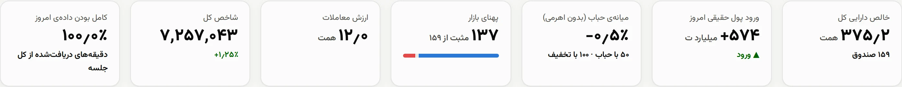
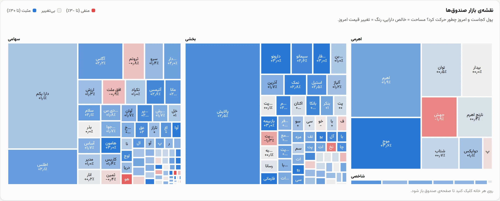
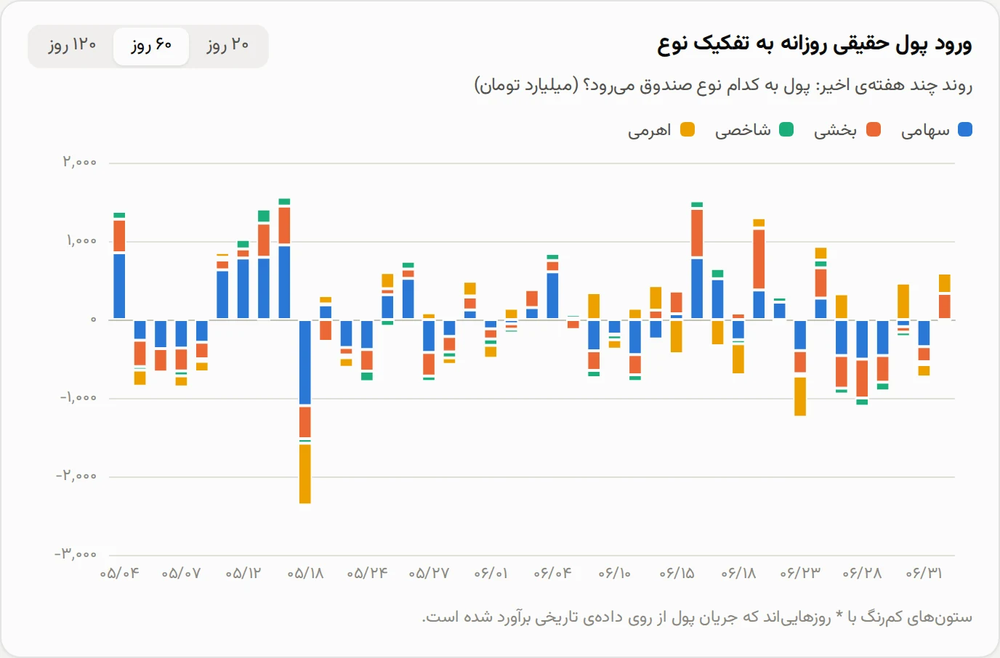
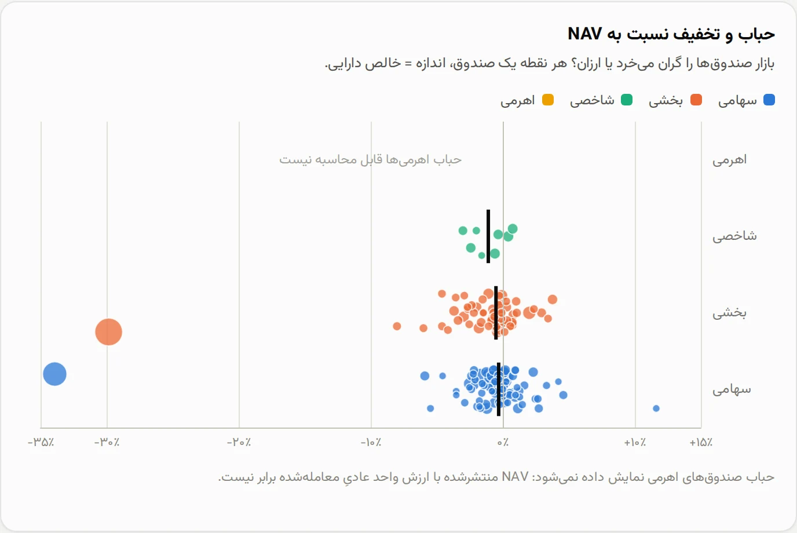
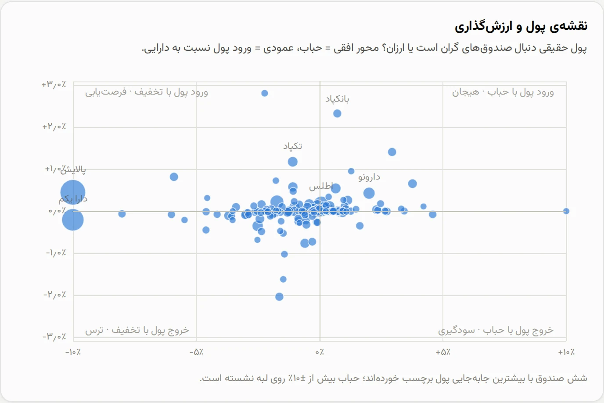
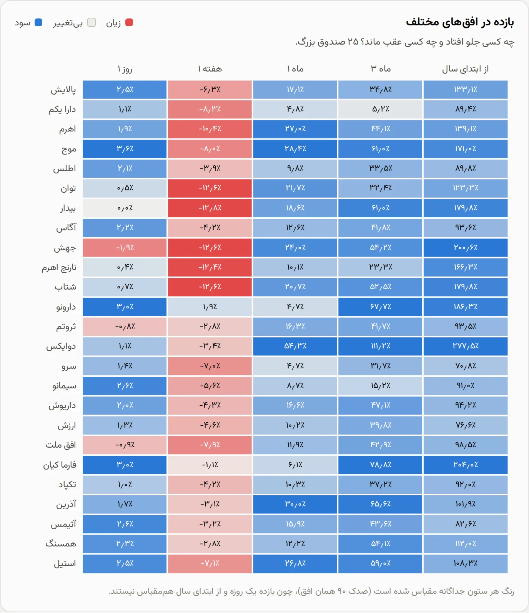
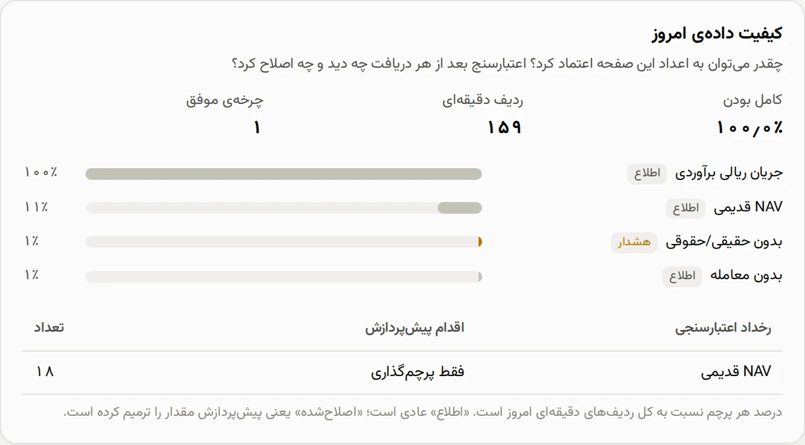
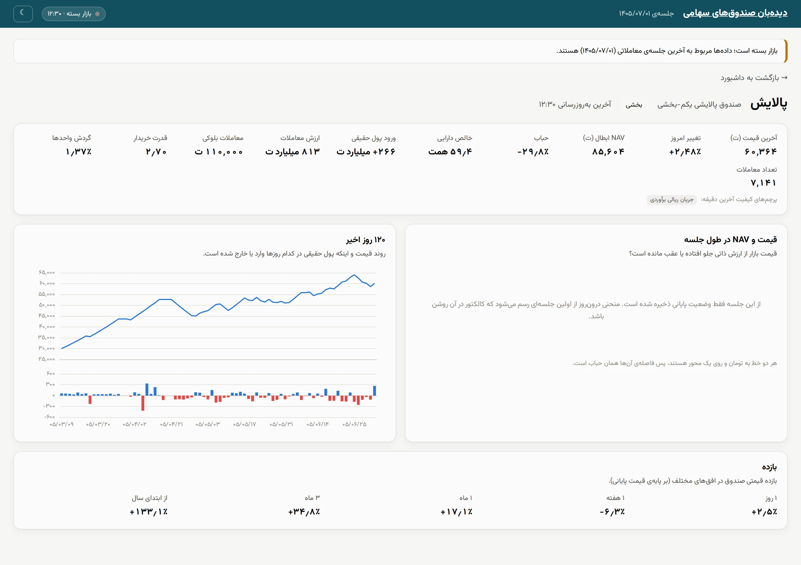
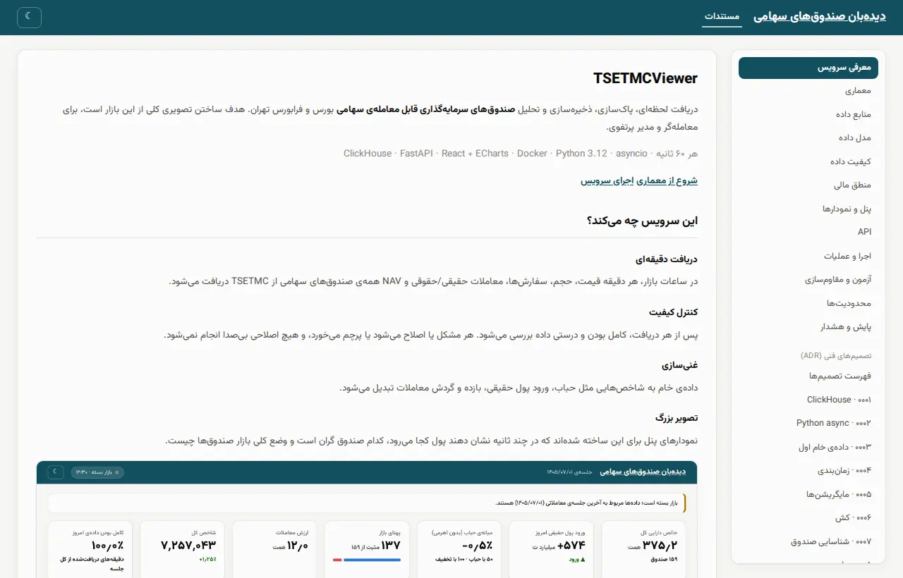

# Dashboard and Analytical Charts

The dashboard was built so a trader or portfolio manager can see the equity-fund market's big picture in under a minute: where the money is, which direction it's heading, whether the fund market is being bought expensive or cheap, and how much these numbers can be trusted. Each chart answers one of these questions, and that same question is written under its title in the dashboard.

  
<b>8</b>analytical charts, each for one question

  
<b>0</b>charts with two vertical axes

  
<b>1 event</b>for live updates (SSE); no polling

  
<b>285 KB</b>gzip size of the dashboard's JavaScript, including ECharts

<figure class="shot">

<figcaption>Figure 1 — The top of the dashboard on real end-of-session data from 1 Mehr 1405: KPI tiles and the market map. Light and dark mode each have their own separate colors, and this image changes with this site's own theme too.</figcaption>
</figure>

!!! info "Data behind the screenshots"
    The screenshots on this page are taken from the real dashboard on real data — exactly what a fresh install shows after market close: the fund list, NAV, 400 days of history, and the **end-of-day snapshot** of the 1 Mehr 1405 session (responses recorded on 2 Mehr that went through the `bootstrap` path). Intraday charts need minute-level data from inside a live session. During the project's build window, the service wasn't running on the user's system during any live session, so those two charts are empty in the screenshots ([Limitations](10-limitations.md)).

## A one-minute routine for reading the dashboard

The dashboard is laid out top to bottom, from **general to specific**, and the card order matches the order a portfolio manager typically asks these questions:

| Step | Where to look | Question | Time |
|:---:|---|---|:---:|
| 1 | Top-of-page tiles | Is today a day of inflows or outflows? Is the market expensive or cheap? | 5 seconds |
| 2 | Market map | Is this move broad-based, or just a few large funds? | 10 seconds |
| 3 | Intraday and daily net inflow | Did this flow just start, or is it the continuation of a multi-week trend? | 15 seconds |
| 4 | Premium and money map | Is money chasing expensive funds (exuberance) or cheap ones (bargain-hunting)? | 15 seconds |
| 5 | Returns, and risk vs. return | Who's ahead, and at what cost (volatility)? | 15 seconds |
| 6 | Data quality | Can all of this be trusted? | 5 seconds |

After this walkthrough, the table and each fund's page are there for a closer look: clicking on any fund in the map, the premium chart, the money map, the returns chart, or the table opens that fund's page.

## Design principles

-   :material-help-circle-outline: __One chart, one question__

    If we can't write the question a chart answers in a single sentence, that chart doesn't get built. That same sentence appears under each card's title in the dashboard.

-   :material-palette-outline: __Color carries exactly one meaning__

    **Identity** (fund type): four fixed colors — blue, orange, teal, and yellow — always in that order. **Direction** (positive/negative): a blue ↔ gray ↔ red scale. No color is ever used for both roles.

-   :material-chart-line-variant: __Never two vertical axes__

    Money and the index are two different units. Instead of one chart with two axes, we use two panels sharing one time axis. Two vertical axes let the viewer "see" whatever correlation they want, because each axis's scale can be chosen arbitrarily.

-   :material-table-eye: __Always a tabular view__

    Every number that appears in a chart also appears in the fund table or in a tooltip. So color is never the only way to read a value.

-   :material-arrow-right-bold-outline: __Time runs left to right__

    The dashboard's text is right-to-left, but the time axis, like every financial chart, runs **left (older) to right (newer)**. The value axis is on the left as well. Traders know this orientation from every charting platform, including TSETMC's own charts ([Day 7 review](#day-7-review-time-axis-direction)).

-   :material-lightning-bolt-outline: __Live, without polling__

    The dashboard holds an SSE connection open and waits for a "new tick" event, re-fetching data only at that moment. The previous data stays on screen until fresh data arrives, just dimmed a bit (no jump, no empty skeleton).

-   :material-calendar-search-outline: __Session picker__

    A `<select>` in the dashboard header ("Live session (latest)" plus every session `fund_ticks` has data for) sets the `?date=` parameter on every endpoint — something the [API](07-api.md) had supported from the start but the dashboard had no control for. Sessions that have only an end-of-day snapshot (no minute-by-minute series) are marked "End-of-day only" so an empty intraday chart isn't a surprise.

### Why blue ↔ red, not green ↔ red?

Iranian market convention (and TSETMC itself) uses green for positive and red for negative. But for about 8% of men (red-green color blindness), green and red look nearly identical. We measured this:

| Color pair | Color distance for protan color blindness (ΔE) | Result |
|---|:---:|:---:|
| Green `#006300` ↔ Red `#d03b3b` | 4.6 | Fails (minimum 8) |
| Blue `#2a78d6` ↔ Red `#e34948` | 21.6 | Passes |

So **cell and point colors** (market map, returns, net inflow) are blue ↔ red. **Number text** in tables keeps the market's familiar green/red, because there the `+` or `−` sign accompanies the number and color is only a secondary cue. Each sign is printed with a Unicode "left-to-right isolate" (`U+2066…U+2069`) so it always stays to the left of the number within Persian text: "+1.2%" rather than "1.2%+".

## The charts, one by one

### 1. KPI tiles

Question: What's happening today, at a glance?

<figure class="shot">

</figure>

| Tile | Why this number and not another |
|---|---|
| **Total net assets** | The size of the entire equity-fund market. It's the denominator for every other ratio (e.g., net inflow ÷ assets). |
| **Today's retail net inflow** | The single most important signal of retail investor behavior. Its direction is shown three ways: arrow, color, and sign. |
| **Median premium** | **Median**, not mean, because two funds with a 30% discount (Dara-1 and Palayesh) can shift the mean on their own. Leveraged funds are excluded ([why](05-financial-logic.md#finding-leveraged-fund-nav-isnt-comparable-to-price)). |
| **Market breadth** | How many funds are positive, not by how much. A "+1%" day with 137 funds up is different from a "+1%" day driven by just three large funds. The bar under the number shows the ratio of up / unchanged / down. |
| **Trading value** | Today's liquidity. |
| **Overall index** | Context: did the funds move with the market or against it? |
| **Data completeness** | What percentage of the session's minutes were actually collected. If it's low, every other number on the page should be read with caution. |

### 2. Fund market map (treemap)

Question: Where is the money, and how did it move today?

<figure class="shot">

<figcaption>Figure 2 — Each cell's area is the fund's net assets, and its color is today's price change (from red at −3% to blue at +3%). Funds are grouped by type.</figcaption>
</figure>

- **Trader:** sees whether today's move is broad-based or not. If every cell is blue, the move is market-wide. If only one group is blue, the move is sector-specific.
- **Portfolio manager:** sees the weights. In this image, Palayesh alone makes up a large share of the "sector" group, meaning any news about refining funds moves a significant part of this market.
- **Why asset area and not trading value?** The big picture means "where is the money sitting." Trading value swings up and down day to day and would make the map unstable.
- **Why saturate at ±3%?** Most funds move less than 3% in a day. If the scale extended to the full daily price-band limit, every cell would look gray.

### 3. Intraday retail net inflow

Question: Right now, is retail money flowing in or out? And what's the overall index doing alongside it?

Two panels on one shared time axis: on top, **cumulative retail net inflow** across all funds (blue area, with the latest value at the end of the line), and below it the **overall index**, dimmed since it's only context. The vertical crosshair moves across both panels together.

- **Trader:** reads the slope of the curve. An outflow in the first hour that reverses by the end differs from an outflow that persists through the close.
- **Why cumulative?** Minute-by-minute flow is noisy. A running total answers the question a trader actually asks: "how much so far?"
- **Why the index in a separate panel?** With two axes on one chart, you can "manufacture" any correlation you want by picking the scale. With two aligned panels, the viewer does the comparison themselves.
- **A session where the collector was off:** for that session only an **end-of-day snapshot** exists ([ADR 0004](adr/0004-scheduling.md#day-5-review-startup-outside-market-hours)). Every other card still fills in, and this card explains why it has no intraday curve instead of just showing an empty chart.

### 4. Daily retail net inflow by fund type

Question: What's the trend over recent weeks, and which fund type is money flowing into?

<figure class="shot">

<figcaption>Figure 3 — Signed stacked bars: inflows stack above zero and outflows stack below it. A dimmed bar marked with * is a day whose rial flow was estimated from volume × average price.</figcaption>
</figure>

- **Portfolio manager:** sees money rotating between fund types. In this image, across the four sessions of 11–17 Mordad, about 4.3 trillion toman of retail money flowed almost entirely into **equity** and **sector** funds, while inflow to leveraged funds was close to zero. On 18 Mordad, 2.4 trillion toman suddenly left, a third of it from **leveraged funds**. This pattern is visible only when fund types are kept separate.
- **Why signed stacking and not net?** Showing only the daily net would make a day where 500 billion toman entered equity funds and 500 billion left leveraged funds look like "zero." The stacked chart reveals this rotation.
- **Why are estimated days dimmed?** TSETMC doesn't publish an official rial value for retail/institutional flow on the current day, so the service estimates it ([Data quality](04-data-quality.md)). The dashboard doesn't hide that this is an estimate.
- The 20-, 60-, or 120-day window is chosen with a control above the card.

### 5. Premium and discount to NAV

Question: Is the market buying funds expensive or cheap, and where?

<figure class="shot">

<figcaption>Figure 4 — Each point is a fund: the horizontal axis is premium, the row is fund type, and point size is net assets. The short black line marks each row's median.</figcaption>
</figure>

- **Trader:** spots the outliers. The large points at −35% (Dara-1) and −30% (Palayesh) aren't arbitrage opportunities (they have redemption caps), and this chart shows them separately rather than folding them into an average.
- **Portfolio manager:** compares each row's median against zero. A positive and rising median in equity funds is usually a sign of retail exuberance.
- **The leveraged row is deliberately empty.** Their −18% "premium" is artificial (the published NAV isn't a per-unit value that's actually traded). Showing this number would mean showing an opportunity that doesn't exist ([details](05-financial-logic.md#finding-leveraged-fund-nav-isnt-comparable-to-price)).
- **Why a scatter plot instead of an average per type?** A single average both hides the spread and gets dragged around by two specific funds. The spread of points is itself information.

### 6. Money map and valuation

Question: Is retail money chasing expensive funds or cheap ones?

<figure class="shot">

<figcaption>Figure 5 — The horizontal axis is premium, the vertical axis is today's retail net inflow relative to that same fund's net assets. The four quadrants represent four different behaviors.</figcaption>
</figure>

This chart places two financial metrics side by side and translates them into behavior:

| Quadrant | Meaning | Takeaway |
|---|---|---|
| Inflow with a premium | Buying despite being expensive | **Exuberance**: correction risk |
| Inflow with a discount | Buying cheap | **Bargain-hunting**: healthier behavior |
| Outflow with a discount | Selling despite being cheap | **Fear**: selling pressure |
| Outflow with a premium | Selling while expensive | **Profit-taking** |

- **Why net inflow relative to assets, and not the raw amount?** 10 billion toman is negligible for a 50-trillion-toman fund but 2% of assets for a 500-billion-toman one. The ratio makes small and large funds comparable.
- **Why only six labels?** Labeling every point would make the chart unreadable. Only the six funds with the largest money movement are labeled; the rest are read via tooltip.
- Premiums beyond ±10% are clamped to the chart's edge rather than dropped.

### 7. Market premium over time {#7-market-premium-over-time}

Question: Is the fund market getting more expensive or cheaper?

Two lines on one percentage axis: **median premium** (solid line) and **net-asset-weighted premium** (dashed line). A control above the card switches between "Today" (minute by minute) and "Daily" (end of each session).

- **Trader:** a steadily rising median through the session means buying exuberance is building. This is exactly what the point-in-time premium chart (Section 5) can't show in a single snapshot.
- **Portfolio manager:** watches the gap between the two lines. In the 1 Mehr 1405 data, the median was −0.5% while the weighted figure was −11.8%, almost entirely driven by the two large funds Palayesh and Dara-1 ([financial logic](05-financial-logic.md#premium-median-or-weighted)). When this gap narrows or widens, it means large funds are decoupling from the rest of the market.
- **Why a dashed line for the weighted series?** Color alone isn't enough for color blindness. Line style is the second cue, and the legend and the label at each line's end both name it too.
- **Limitation:** TSETMC doesn't provide NAV history, so the daily view is built starting from the first day the service collected data. Until at least two days have accumulated, the card explains this instead of showing a chart.

### 8. Returns across horizons

Question: Who's ahead and who's behind, and over what horizon?

<figure class="shot half">

<figcaption>Figure 6 — The 25 largest funds (by net assets) across five horizons.</figcaption>
</figure>

- **Portfolio manager:** sees inconsistency across horizons. In this image, seven leveraged funds returned between 123% and 201% year-to-date but lost 8 to 13% over the past week — a strong medium-term trend with a short-term correction.
- **The most important decision: each column's color is scaled independently** (the color ceiling is the 90th percentile for that horizon). A one-day return is usually under 3%, and a year-to-date return can exceed 100%. With a shared scale, the one-day column would look entirely gray. The number is printed inside every cell, so a separate scale per column hides nothing.
- **Why the 90th percentile and not the maximum?** One exceptional fund (say, +277%) would, with a max-based scale, wash out every other cell.

### 9. Risk and the trailing 90-day return {#9-risk-and-trailing-90-day-return}

Question: For the volatility a fund delivered, was its return worth it?

Each point is a fund: the horizontal axis is the annualized volatility of daily returns (standard deviation × √252), the vertical axis is the return over that same 90-day window, size = net assets, color = fund type.

- **Portfolio manager:** this chart completes the project's sixth requirement for the risk dimension; the market map and money map show "where," this chart shows "at what cost." A fund with high volatility and a return near zero (bottom-right corner) doesn't make sense to hold long-term, no matter how familiar its name is.
- **Trader:** leveraged funds usually sit on the right side of the chart (high volatility); their vertical spread shows which leverage actually converted that volatility into return.
- **Why 90 days and not the full history?** A shorter window for volatility stays closer to the market's current regime; 90 days is also enough for statistical stability without being stale.
- **Limitation:** under 5 days of closing prices, volatility can't be computed, and the fund is dropped from the chart (not from the table); this applies to new funds or funds whose history hasn't filled in yet.

### 10. Today's data quality

Question: How much can the numbers on this page be trusted?

<figure class="shot half">

<figcaption>Figure 7 — Session completeness, each quality flag's share of today's rows, and validation events along with the action preprocessing took.</figcaption>
</figure>

This card makes the project's third requirement — "verifying completeness and correctness of the data after every fetch" — visible to the dashboard user. Flags fall into three categories, each with its own color and label:

- **Info** (gray): a normal, expected state, such as "stale NAV" after the market closes.
- **Corrected** (blue): preprocessing repaired a value, such as filling a missing minute from the previous one.
- **Warning** (yellow): a value should be read with caution, such as a retail/institutional volume mismatch.

In the fund table, each row also carries an "n flags" badge; hovering over it shows the list of flags.

### 11. Fund table and the per-fund page

**Symbol status.** A fund that isn't "authorized" ("مجاز") on TSETMC (for example, "authorized-halted" or "banned") gets a red badge in the table and on its own page with that same TSETMC label, and "reserved" or "under review" get an orange badge. A banner at the top of the dashboard also names these funds, because a halted fund's price and premium are from its last trade before the halt, and without this badge it would look like just a quiet fund. Each fund's status is at most 5 minutes old, and the time of the last check appears in the badge's tooltip.

The table shows every equity-family fund with all its metrics: sortable on any column, searchable by ticker or name, and keyboard-navigable. Invalid values (such as leveraged funds' premium) are shown as "—" and always sort last.

<figure class="shot">

<figcaption>Figure 8 — The "Palayesh" fund page: real-time metrics, intraday price and NAV (on one axis, in toman), price and net-inflow history, and returns across five horizons.</figcaption>
</figure>

In the fund page's intraday chart, **price and NAV share one axis** because both are in toman. The gap between the two lines is the premium, and the viewer sees it directly. If the collector came up late, the price before that point is reconstructed from tick-level trades and drawn as a **dashed line** ([ADR 0012](adr/0012-intraday-backfill.md)). The dashed segment connects to the first live point, has no NAV there, and the chart's legend reads "reconstructed from tick data": the viewer should know which part was actually observed and which was reconstructed. In the daily history chart, price and net inflow are two different units, so again we use two panels on one shared time axis. Its window (1 month, 3 months, 6 months, 1 year, or all) is chosen with a control above the card. In "all" mode, the text below the chart states how many days of history are stored and how to extend it (`backfill --days N`), since the collector keeps 400 trading days by default.

### 12. Documentation, inside the dashboard itself

Question: Where are all these decisions and financial details documented?

<figure class="shot">

<figcaption>Figure 9 — These same 12 documents and every ADR, rendered from the same <code>docs/*.md</code> files, with no summarizing and no separate service.</figcaption>
</figure>

- **A link, not a content tab.** "Documentation" sits next to the page title at the top, not alongside the overview/valuation/money-flow/returns/table tabs, because it's a standalone page, not one of the dashboard's sections; switching to it doesn't bring along the KPI tiles, the session status bar, or the dashboard's session picker.
- **The same content, not a summary of it.** The `docs/*.md` and `docs/adr/*.md` files go through a one-time preprocessing step out of MkDocs syntax (admonitions, grid cards, `assets/diagrams/*.svg` references inlined raw) into plain Markdown+HTML and are stored in `web/src/assets/docs-content/`; the dashboard renders them with `react-markdown`, not a shorter hand-written version.
- **A separate bundle.** The weight of react-markdown and the documentation text is lazy-loaded with `React.lazy`, so the dashboard's initial load doesn't get any heavier.

## What was deliberately not built

| Idea | Why not (for now) |
|---|---|
| Candlestick chart per fund | That's for technical analysis of a single fund, not the market's big picture. Brokerage sites already do it better. |
| Fund correlation matrix | With 159 funds, a 159×159 matrix isn't readable. Its useful form (clustering) doesn't fit in 7 days. |
| Fund portfolio composition (by industry) | TSETMC doesn't provide it, and its source (Codal's monthly reports) needs a separate extraction pipeline. |
| Price alerts and watchlists | They require user accounts, which is out of scope for this project. |
| Forecasting | The dashboard should accurately show what is. An unfounded forecast lends credibility to a bad decision. |

## Implementation

-   :material-react: __React 19 + Vite + TypeScript strict__

    Two views (dashboard and fund page) with hash-based routing. No router or state-management library was needed: a small `useQuery` hook and a `useLiveTicks` hook are enough ([ADR 0008](adr/0008-web-panel.md)).

-   :material-chart-box-outline: __ECharts with SVG rendering__

    Persian text with the Vazirmatn font shapes correctly, and the image stays sharp at any zoom level. Only five chart types are registered, so ECharts' footprint dropped from 1.1 MB to 596 KB (204 KB gzip).

-   :material-function-variant: __Each chart's option is a pure function__

    `charts/options.ts` builds the chart option from (data, color tokens), so it has unit tests with no browser involved: excluding leveraged funds, clamping large premiums to the edge, map grouping, and color scaling.

-   :material-server-network: __Same-origin nginx__

    The `web` container serves the built files and proxies `/api` to FastAPI, so CORS isn't needed at runtime. nginx buffering is turned off for SSE, hashed files are cached for a year, and `index.html` is always revalidated.

### The live-update cycle

1. The collector records a cycle in ClickHouse and publishes the new tick on Redis.
2. The API forwards it as a `tick` event on `/api/v1/stream` to every open browser.
3. The dashboard increments its tick counter and each card re-fetches its own data.
4. The browser requests with `If-None-Match`. If nothing changed, the response is a bodyless `304`; if it changed, the response is served from the Redis cache ([ADR 0006](adr/0006-caching.md)).

Outside market hours no tick arrives, so the dashboard sends no requests either. A banner at the top of the page states that the data is from the last session.

### Accessibility

- Every chart has `role="img"` and a descriptive `aria-label`.
- The color legend is plain HTML, and its text is rendered in the text color, not the series color.
- Table rows open via Tab and Enter.
- Dark mode isn't an automatic color inversion: every color was chosen separately for the dark background.

## Day 7 review: time-axis direction {#day-7-review-time-axis-direction}

**Initial decision (Day 5):** because the dashboard is right-to-left, the time axis was flipped too, so the newest point would land at the end of the reading path — the left side.

**Feedback:** a user asked for charts with dates increasing left to right. This feedback is correct: time-axis direction is a **domain convention of finance**, not a language feature. An Iranian trader sees price charts left-to-right every day on TSETMC, brokerage platforms, and technical-analysis tools. A reversed chart makes an "uptrend" read as a downtrend at first glance, which is a steep cost for a tool whose whole purpose is "getting the big picture right."

**Change:**

- Every time axis (intraday net inflow, daily net inflow, intraday price and NAV, fund daily history) now runs left to right, with the value axis on the left.
- The returns heatmap's columns are also ordered short to long horizon, left to right (1 day … year-to-date).
- The option builders sort the data chronologically themselves (`chronological`) rather than relying on the API's response order. A test guarantees no time axis is ever `inverse`.
- Text, tables, legends, and tooltips remain right-to-left.

## Post-day-7 review: premium over time, holidays, and collector health

- **New chart:** "Market premium over time" ([Section 7](#7-market-premium-over-time)). The "Median premium" tile now also shows the weighted premium alongside the median.
- **Holiday:** if today is an official holiday or an observed closure, the banner at the top of the page names it, e.g. "Today is a holiday (Arbaeen)." So the user knows why today's data hasn't arrived.
- **Collector stopped:** if the market is open but no fresh data arrives, the indicator at the top of the page switches to "stale data" and a banner states the number of minutes and the likely cause (VPN). The dashboard checks this every minute via `/api/v1/health`, since a collector that's down sends no tick to wake the dashboard.
