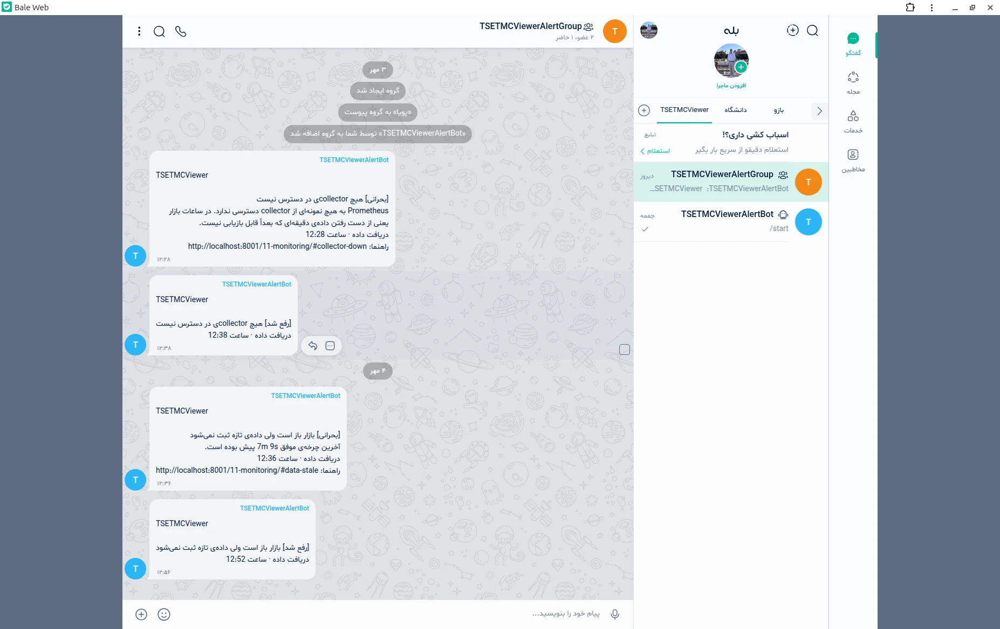
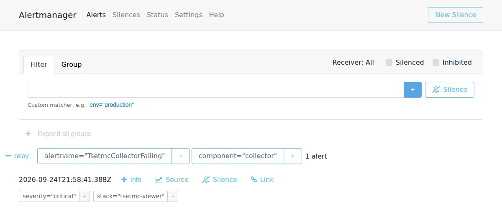

# پایش و هشدار

<p class="lead">سه چیز باید همیشه معلوم باشد: collector داده می‌گیرد یا نه، API به پنل جواب می‌دهد یا نه، و ClickHouse سالم است یا نه. هر سرویس معیارهای خودش را منتشر می‌کند، Prometheus آن‌ها را جمع می‌کند، Grafana نشانشان می‌دهد و Alertmanager هر مشکل را، به فارسی و همراه با لینک راهنمای همین صفحه، به بله، تلگرام یا هر webhook دیگری می‌فرستد.</p>

<div class="kpis">
  <div class="kpi"><b>۴</b><span>داشبورد Grafana، تعریف‌شده به‌صورت کد</span></div>
  <div class="kpi"><b>۱۶</b><span>هشدار، هر کدام با یک راهنمای رفع در این صفحه</span></div>
  <div class="kpi"><b>۸</b><span>سناریوی تست واحد برای قواعد هشدار (promtool)</span></div>
  <div class="kpi"><b>۰</b><span>رمز در فایل‌های پیکربندی؛ همه در ‎.env</span></div>
</div>

<figure class="diagram" markdown>

<figcaption>شکل ۱ — هر سرویس خودش <code>/metrics</code> دارد و exporter جداگانه‌ای لازم نیست؛ ClickHouse هم خروجی داخلی خودش را دارد. خط نارنجی مسیر هشدار است.</figcaption>
</figure>

## راه‌اندازی

```bash
docker compose --profile monitoring up -d        # Prometheus، Alertmanager، Grafana، alert-relay
```

| آدرس | چه چیزی |
|---|---|
| <http://localhost:3000> | **Grafana** (نام کاربری و رمز: `GRAFANA_USER` / `GRAFANA_PASSWORD`، پیش‌فرض admin). صفحه‌ی اول، داشبورد «نمای کلی» است |
| <http://localhost:9090/alerts> | Prometheus: وضعیت همه‌ی هشدارها |
| <http://localhost:9093> | Alertmanager: هشدارهای فعال، خاموش کردن موقت (silence) |

پایش در یک **profile** جداست: stack اصلی بدون آن هم کامل کار می‌کند، و کسی که فقط پنل را می‌خواهد سه ایمیج اضافه دانلود نمی‌کند (دانلود از Docker Hub با VPN انجام می‌شود، [راهنمای اجرا](08-runbook.md)). همه‌ی پورت‌های پایش فقط روی `127.0.0.1` باز هستند.

### گرفتن هشدار در «بله»

TSETMC فقط از IP ایران در دسترس است، پس سرور معمولاً در ایران است. در این حالت تلگرام در دسترس نیست، ولی **بله** هست، و API بازوی بله با تلگرام سازگار است:

1. در بله با `@botfather` یک بازو بسازید و توکن آن را بگیرید.
2. بازو را به گروه یا کانال هشدار اضافه کنید و شناسه‌ی گفتگو (chat id) را پیدا کنید.
3. در `.env` بنویسید:

    ```bash
    ALERT_BALE_TOKEN=123456:ABC...
    ALERT_BALE_CHAT_ID=987654321
    ```

4. `docker compose --profile monitoring up -d alert-relay`. در لاگ باید `alert relay ready` با `"channels": ["bale"]` دیده شود.

تلگرام (`ALERT_TELEGRAM_*`) و هر webhook دیگر (`ALERT_WEBHOOK_URL`، مثلاً n8n یا پل Slack/Mattermost) هم به همین شکل فعال می‌شوند و می‌توانند هم‌زمان روشن باشند. بدون هیچ کانالی، هشدارها فقط در لاگ alert-relay نوشته می‌شوند.

!!! question "چرا یک relay و نه گیرنده‌های خود Alertmanager؟"
    گیرنده‌ی تلگرام Alertmanager همیشه `parse_mode` می‌فرستد، که در مستندات بازوی بله نیامده است. relay متن ساده می‌فرستد که هر دو قبول می‌کنند. Alertmanager متغیر محیطی هم نمی‌خواند، پس توکن باید در فایل پیکربندی نوشته شود. relay مثل بقیه‌ی سرویس‌ها `.env` را می‌خواند. پیام‌ها هم از روی annotationهای فارسی قواعد ساخته می‌شوند. relay فقط وقتی به Alertmanager خطا برمی‌گرداند که **همه‌ی** کانال‌ها شکست خورده باشند، تا تکرار پیام، پیام تحویل‌شده را دوباره نفرستد.

یک پیام واقعی از تمرین قطعی (بخش [تمرین](#تمرین-قطعی-روی-سیستم-واقعی)):

```text
TSETMCViewer

[بحرانی] چرخه‌های دریافت پشت سر هم شکست می‌خورند
7 چرخه‌ی ناموفق پیاپی. شایع‌ترین علت: TSETMC از این IP در دسترس نیست (VPN روشن است).
دریافت داده · ساعت 01:28
راهنما: http://localhost:8001/11-monitoring/#collector-failing
```

<figure class="shot" markdown>

<figcaption markdown="span">همان بازو (`TSETMCViewerAlertBot`) روی گروه واقعی در بله: هشدار بحرانی «collector در دسترس نیست» ساعت ۱۲:۲۸ و رفعش ساعت ۱۲:۳۸، سپس هشدار «داده‌ی تازه ثبت نمی‌شود» و رفعش — هر پیام با لینک راهنمای همین صفحه.</figcaption>
</figure>

از این نمونه‌ی واقعی هم دیده می‌شود: relay فقط رخداد را می‌فرستد، نه هر تکرار Alertmanager (هر پیام یک بار «شروع» و یک بار «رفع شد»)، و لینک راهنما در هر دو هست.

## معیارها

همه‌ی معیارها در یک فایل تعریف شده‌اند: `src/tsetmc_viewer/telemetry.py`. مقدار برچسب‌ها همیشه محدود است (نام endpoint، وضعیت، الگوی مسیر مثل `/api/v1/funds/{ins_code}`)، هیچ‌وقت کد نماد یا URL خام، تا تعداد سری‌های زمانی کنترل‌شده بماند.

=== "collector"

    | معیار | نوع | معنی |
    |---|---|---|
    | `tsetmc_collector_cycles_total{status}` | counter | چرخه‌ها به تفکیک ok / partial / failed |
    | `tsetmc_collector_cycle_duration_seconds` | histogram | مدت هر چرخه (بودجه: ۶۰ ثانیه) |
    | `tsetmc_collector_last_success_timestamp_seconds` | gauge | زمان آخرین چرخه‌ای که داده نوشت |
    | `tsetmc_collector_failed_streak` | gauge | تعداد شکست‌های پیاپی |
    | `tsetmc_collector_funds_received` / `_expected` | gauge | کامل بودن آخرین چرخه |
    | `tsetmc_collector_quality_issues_total{check,action}` | counter | رخدادهای اعتبارسنج ([کیفیت داده](04-data-quality.md)) |
    | `tsetmc_collector_rows_repaired_total{kind}` | counter | ردیف‌های تکمیل یا اصلاح‌شده |
    | `tsetmc_collector_leader` | gauge | ۱ اگر این نمونه رهبر است ([ADR 0010](adr/0010-high-availability.md)) |
    | `tsetmc_market_open` · `tsetmc_session_confirmed` | gauge | تقویم (با تعطیلات) و تأیید جلسه از روی TSETMC |
    | `tsetmc_source_requests_total{endpoint,outcome}` | counter | نتیجه‌ی نهایی هر درخواست به TSETMC، پس از retry |
    | `tsetmc_source_request_duration_seconds{endpoint}` | histogram | تأخیر هر تلاش |
    | `tsetmc_source_retries_total{endpoint}` | counter | تلاش‌های دوباره |

=== "API"

    | معیار | نوع | معنی |
    |---|---|---|
    | `tsetmc_api_requests_total{route,method,status}` | counter | درخواست‌ها به تفکیک الگوی مسیر |
    | `tsetmc_api_request_duration_seconds{route}` | histogram | تأخیر (SSE از آن کنار گذاشته شده است) |
    | `tsetmc_api_cache_total{result}` | counter | hit / miss / shared / not_modified |
    | `tsetmc_api_sse_clients` | gauge | پنل‌های باز با اتصال زنده |
    | `tsetmc_api_database_unavailable_total` | counter | پاسخ‌های 503 به‌خاطر قطعی ClickHouse |

    با چند worker، هر پروسه معیارهایش را در یک پوشه‌ی مشترک می‌نویسد و `/metrics` جمع همه را برمی‌گرداند (حالت multiprocess در prometheus_client).

=== "ClickHouse"

    خروجی داخلی ClickHouse (`docker/clickhouse/prometheus.xml`، پورت ۹۳۶۳). داشبورد و هشدارها از این‌ها استفاده می‌کنند: `ClickHouseProfileEvents_SelectQuery` / `InsertQuery` / `FailedQuery` / `InsertedRows`، `ClickHouseMetrics_MemoryTracking` / `Merge`، و `ClickHouseAsyncMetrics_MaxPartCountForPartition` / `FilesystemMainPath*Bytes`.

!!! tip "یک تست جلوی «داشبورد بی‌داده» را می‌گیرد"
    `tests/test_monitoring_config.py` هر نام معیار `tsetmc_*` در قواعد و داشبوردها را با معیارهایی که واقعاً ثبت شده‌اند مقایسه می‌کند. داشبوردی که معیار ناموجود را بپرسد همیشه «No data» نشان می‌دهد، که شبیه آرامش است و به همین دلیل خطرناک‌ترین نوع خطای پایش است. همان تست بررسی می‌کند که هر jobی که قواعد به آن ارجاع می‌دهند واقعاً خوانده شود، لینک راهنمای هر هشدار در این صفحه وجود داشته باشد، و JSON داشبوردها با کدشان یکی باشد.

## داشبوردها

داشبوردها در `monitoring/grafana/build_dashboards.py` تعریف و با `python monitoring/grafana/build_dashboards.py` به JSON تبدیل می‌شوند. Grafana آن‌ها را هنگام شروع بارگذاری می‌کند و ویرایش در رابط کاربری بسته است، چون تغییر باید در کد و در بازبینی دیده شود.

!!! note "پیکربندی داخل ایمیج است"
    داشبوردها، قواعد Prometheus، پیکربندی Alertmanager و `prometheus.xml` ClickHouse در ایمیج کپی می‌شوند، نه از دیسک mount. پس از هر تغییر: `docker compose --profile monitoring up -d --build`. دلیلش در [ADR 0009](adr/0009-observability.md#بازبینی-پیکربندی-داخل-ایمیج-نه-mount) آمده است.

| داشبورد | سؤال | پنل‌ها |
|---|---|---|
| **نمای کلی** | همه چیز سالم است؟ | در دسترس بودن collector، API و ClickHouse، باز بودن بازار، عمر آخرین داده، شکست پیاپی، **هشدارهای فعال**، چرخه‌ها و درخواست‌ها |
| **دریافت داده** | داده کامل و به‌موقع می‌آید؟ | رهبر، تأیید جلسه، کامل بودن، نتیجه و مدت چرخه‌ها، درخواست‌ها و تأخیر هر endpoint، retry، رخدادهای کیفیت و ردیف‌های اصلاح‌شده |
| **API** | پنل سریع و درست جواب می‌گیرد؟ | درخواست در ثانیه، نسبت ۵xx، صدک ۹۵ تأخیر، نرخ استفاده از کش، اتصال‌های زنده، 503ها، تأخیر هر مسیر |
| **ClickHouse** | پایگاه داده جا و توان دارد؟ | در دسترس بودن، فضای دیسک، بیشترین part در یک پارتیشن، حافظه، کوئری‌ها و ردیف‌های درج‌شده، زمان SELECT، ادغام‌ها |

همه‌ی کوئری‌های داشبوردها روی یک Prometheus واقعی اجرا شدند. در اجرای اول ۴۲ کوئری از ۴۴ کوئری داده داشتند. دو کوئری باقی‌مانده معیارهایی بودند که فقط هنگام خطا مقدار می‌گیرند (retry و ۵xx) و «No data» نشان می‌دادند، که با «هیچ خطایی نیست» فرق دارد. حالا این دو کوئری در نبود خطا صفر نشان می‌دهند، و پس از تمرین قطعی هر ۴۵ کوئری داده داشتند.

## هشدارها و راهنمای رفع

هشدارهای **بحرانی** یعنی داده از دست می‌رود یا کاربر چیزی نمی‌بیند (تکرار هر ۳۰ دقیقه). **هشدار** یعنی کیفیت پایین آمده است (تکرار هر ۴ ساعت). Alertmanager علت ریشه‌ای را جایگزین پیامدهایش می‌کند: وقتی ClickHouse قطع است، «داده‌ی قدیمی» و «خطای API» جداگانه فرستاده نمی‌شوند، و وقتی collector پشت سر هم شکست می‌خورد، «خطای منبع» و «کامل نبودن داده» ساکت می‌مانند. پس هر رخداد یک پیام است.

<figure class="shot half" markdown>

<figcaption>Alertmanager در تمرین قطعی: هشدار بحرانی collector، گروه‌بندی‌شده و آماده‌ی ارسال به relay.</figcaption>
</figure>

### collector در دسترس نیست {#collector-down}

**`TsetmcCollectorDown`** · بحرانی · ۲ دقیقه. Prometheus به هیچ نمونه‌ای از collector دسترسی ندارد. در ساعات بازار، هر دقیقه‌ای که بگذرد داده‌ای از دست می‌رود که [قابل بازیابی نیست](adr/0003-raw-first-ingestion.md).

```bash
docker compose ps collector            # Exited؟ unhealthy؟
docker compose logs --tail=100 collector
docker compose up -d collector
```

### collector رهبر ندارد {#no-leader}

**`TsetmcNoLeader`** · بحرانی · ۳ دقیقه. collectorها بالا هستند اما هیچ‌کدام lease رهبری را ندارند. معمولاً Redis قطع بوده و نمونه‌ها هنوز lease را دوباره نگرفته‌اند (هر ۱۵ ثانیه تلاش می‌کنند). `docker compose ps redis` و لاگ `leadership` را ببینید.

### بیش از یک رهبر {#split-brain}

**`TsetmcSplitBrain`** · هشدار · ۵ دقیقه. چند نمونه هم‌زمان داده جمع می‌کنند. داده خراب نمی‌شود، چون کلید هر ردیف (صندوق، دقیقه) است و ClickHouse تکراری‌ها را حذف می‌کند، ولی بار روی TSETMC چند برابر است. علت معمول: Redis خطا می‌دهد و هر نمونه طبق طراحی خودش را رهبر فرض می‌کند ([ADR 0010](adr/0010-high-availability.md)).

### چرخه‌ها پشت سر هم شکست می‌خورند {#collector-failing}

**`TsetmcCollectorFailing`** · بحرانی · ۱ دقیقه. شایع‌ترین علت روی سیستم توسعه این است که **VPN روشن است** و TSETMC IP خارجی را رد می‌کند. در لاگ collector دنبال `source error` بگردید. اگر خطا `ConnectError` یا `403` است، [شبکه](08-runbook.md#شبکه-vpn-و-tsetmc) را درست کنید. collector خودش ادامه می‌دهد و restart لازم نیست.

### بازار باز است ولی داده‌ی تازه ثبت نمی‌شود {#data-stale}

**`TsetmcDataStale`** · بحرانی · ۲ دقیقه. بازار همین الان باز است (`tsetmc_market_open == 1`، سیگنال زنده — نه `tsetmc_session_confirmed` که تا آخر روز تقویمی ۱ می‌ماند و بعد از بسته شدن بازار هم ۱ است)، اما بیش از ۵ دقیقه است که هیچ چرخه‌ای داده ننوشته است. اگر collector شکست نمی‌خورد، معمولاً نوشتن در ClickHouse مشکل دارد: لاگ‌های `cycle crashed` را ببینید.

### کامل نبودن داده {#low-completeness}

**`TsetmcLowCompleteness`** · هشدار · ۱۰ دقیقه. در هر چرخه کمتر از ۹۰٪ صندوق‌ها دریافت می‌شوند. داشبورد «دریافت داده» → «درخواست‌ها بر اساس نتیجه» نشان می‌دهد کدام endpoint خطا دارد (معمولاً NAV یک صندوق).

### خطای منبع داده {#source-errors}

**`TsetmcSourceErrors`** · هشدار · ۱۰ دقیقه. بیش از ۲۰٪ درخواست‌ها، حتی پس از retry، ناموفق‌اند. TSETMC کند یا ناپایدار است. اگر ادامه پیدا کند، `HTTP_MAX_CONCURRENCY` را کمتر کنید.

### چرخه‌های کند {#slow-cycles}

**`TsetmcSlowCycles`** · هشدار · ۱۵ دقیقه. صدک ۹۵ مدت چرخه از ۴۵ ثانیه گذشته است. با بودجه‌ی ۶۰ ثانیه‌ای، دقیقه‌ها به‌زودی جا می‌افتند. پنل «تأخیر هر endpoint» نشان می‌دهد کدام درخواست کند شده است ([بودجه‌ی چرخه](01-architecture.md)).

### API در دسترس نیست {#api-down}

**`TsetmcApiDown`** · بحرانی · ۲ دقیقه. `docker compose ps api` و `docker compose logs api`. پنل در این حالت پیام خطا نشان می‌دهد.

### خطای API {#api-errors}

**`TsetmcApiErrors`** · هشدار · ۵ دقیقه. بیش از ۵٪ پاسخ‌ها ۵xx هستند. قطعی ClickHouse پاسخ 503 می‌دهد و هشدار جداگانه‌ی خودش را دارد. ۵۰۰ یعنی باگ است: traceback در لاگ API.

### API کند است {#api-slow}

**`TsetmcApiSlow`** · هشدار · ۱۰ دقیقه. صدک ۹۵ از ۰٫۵ ثانیه گذشته است (در حالت عادی زیر ۰٫۰۵). پنل «نرخ استفاده از کش» را ببینید: اگر افتاده باشد، احتمالاً Redis قطع است و هر درخواست به ClickHouse می‌رسد ([آزمون بار](09-quality-engineering.md#آزمون-بار)).

### ClickHouse در دسترس نیست {#clickhouse-down}

**`ClickHouseDown`** و **`ClickHouseUnavailableForApi`** · بحرانی · ۲ دقیقه. هیچ داده‌ای ذخیره نمی‌شود و API پاسخ 503 می‌دهد. `docker compose logs clickhouse`. شایع‌ترین علت‌ها کمبود حافظه و پر بودن دیسک هستند.

### تعداد part زیاد {#too-many-parts}

**`ClickHouseTooManyParts`** · هشدار · ۱۰ دقیقه. ادغام‌ها از درج‌ها عقب مانده‌اند. در ۳۰۰۰ part، ClickHouse درج را رد می‌کند. در این سرویس هر چرخه یک درج دسته‌ای است، پس این هشدار معمولاً یعنی دیسک یا CPU کم است، یا replay بزرگی در حال اجراست.

### دیسک رو به پر شدن {#disk-low}

**`ClickHouseDiskLow`** · هشدار · ۱۰ دقیقه. کمتر از ۱۰٪ فضای آزاد. بزرگ‌ترین مصرف‌کننده پاسخ‌های خام است (حدود ۱۲۰ مگابایت در روز با TTL سی‌روزه، [محدودیت‌ها](10-limitations.md#محدودیتهای-عملیاتی)). TTL را کوتاه‌تر یا دیسک را بزرگ‌تر کنید.

### کوئری‌های ناموفق {#failed-queries}

**`ClickHouseFailedQueries`** · هشدار · ۱۰ دقیقه. در کارکرد عادی هیچ کوئری ناموفقی نیست. لاگ API را برای `DatabaseError` ببینید. معمولاً یعنی schema با کد هم‌خوان نیست (مایگریشن اجرا نشده است).

## تست قواعد هشدار

قواعد هشدار هم کد هستند و تست دارند: `monitoring/prometheus/rules/tsetmc_test.yml`. هر سناریو یک سری زمانی مصنوعی می‌سازد و بررسی می‌کند که هشدار **درست در زمان مقرر** روشن شود، متن فارسی‌اش درست باشد، و در حالت مشابهِ بی‌خطر (مثلاً داده‌ی قدیمی وقتی بازار بسته است) روشن **نشود**.

```bash
promtool test rules monitoring/prometheus/rules/tsetmc_test.yml   # CI همین را اجرا می‌کند
```

یک باگ واقعی را همین تست‌ها پیدا کردند: در عبارت `A and B`، مقدار هشدار (`$value`) از سمت چپ می‌آید. در نسخه‌ی اول هشدار «داده‌ی قدیمی» سمت چپ `session_confirmed` بود و پیام «۱ ثانیه پیش» می‌گفت. ترتیب دو طرف عوض شد.

## تمرین قطعی روی سیستم واقعی {#تمرین-قطعی-روی-سیستم-واقعی}

کل زنجیره یک بار با باینری‌های واقعی Prometheus 2.55 و Alertmanager 0.27 اجرا شد. دو collector، API با دو worker و alert-relay روی یک کپی از پاسخ‌های واقعی TSETMC کار می‌کردند:

| گام | نتیجه |
|---|---|
| همه‌ی targetها | ۷ از ۷ `up`: دو collector، API، ClickHouse، relay، Prometheus، Alertmanager |
| رهبری | یک collector رهبر (`leader=1`) و دیگری آماده‌به‌کار (`0`) |
| `docker stop` روی رهبر | lease آزاد شد و نمونه‌ی دوم **حدود ۲ ثانیه بعد** رهبر شد |
| قطع TSETMC | پس از ۳ چرخه‌ی ناموفق، `TsetmcCollectorFailing` از pending به firing رفت، Alertmanager آن را به relay داد، و پیام فارسی بالا تحویل webhook شد |
| وصل دوباره‌ی TSETMC | `failed_streak` به صفر برگشت و هشدار رفع شد |
| کوئری‌های داشبورد | هر ۴۵ کوئری روی Prometheus واقعی داده داشتند |

!!! note "Grafana در این تمرین نبود"
    ایمیج Grafana در محیط ساخت در دسترس نبود. JSON داشبوردها با تست بررسی شده‌اند و کوئری‌هایشان روی Prometheus واقعی اجرا شده‌اند، و آزمون دود CI بارگذاری هر چهار داشبورد در Grafana را بررسی می‌کند. تصویر داشبوردها با اولین اجرای کامل روی سیستم کاربر گرفته می‌شود.
